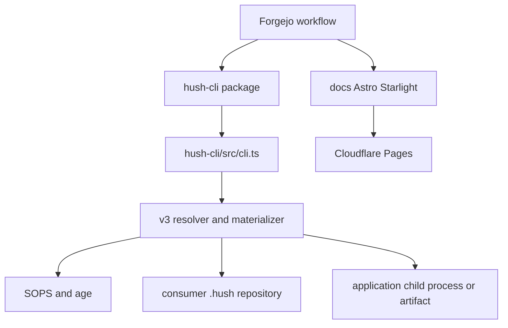

# Hush Repository Architecture

Hush is a local, zero-server secrets manager. The shipped product is the `@chriscode/hush` package in `hush-cli/`; it stores repository authority in encrypted SOPS YAML and exposes the `hush` executable. `docs/` is a separate private Astro/Starlight workspace that documents and deploys the product. The root is orchestration: Bun workspaces, lint/format scripts, CI/release configuration, and Grove/Pitchfork service declarations.

## Boundaries and entrypoints

- **CLI product:** `hush-cli/package.json` publishes `bin/hush.js`, `dist`, and `schema.json`; `hush-cli/src/cli.ts` parses arguments and dispatches commands. `hush-cli/src/index.ts` is the package's public import surface.
- **Encrypted repository:** A consumer repository owns `.hush/manifest.encrypted`, `.hush/files/**.encrypted`, and `.sops.yaml`; Hush reads and mutates those files but does not own the consuming application's source or deployment runtime.
- **Documentation:** `docs/astro.config.mjs` configures Starlight at `https://hush.ch5.me`; `docs/wrangler.toml` deploys `docs/dist` to Cloudflare Pages. Docs are not a runtime dependency of the CLI.
- **External tools:** SOPS and age perform cryptography. Wrangler, Vercel HTTP APIs, npm/CH5 Verdaccio, and Forgejo Actions are integration surfaces, not libraries implemented by this repository.
- **CON-06 contracts:** Hush is not in the CON-06 import matrix. The honest consumer row is `NOT_ACTIVATED` with `pin: null` / `binding: null`; do not add `agent-runtime-contracts` or enable experimental imports. See `.ch5/mig-01-con-06-consumer.json` and `docs/CON-06-CONSUMER.md`.
- **SEC-03 mediation:** Experimental secret-mediation is default-off and disabled (`MISS-SEC03-OWNER-UNRESOLVED`). `admit(destination, action)` is required before use projection; Hush does not invent another vault. See `.ch5/sec-03-mediation.json` and `docs/SEC-03-MEDIATION.md`.
- **SEC-05 isolation:** Tenant and data-disclosure isolation is fixture-only and labeled internal (`customer_release: BLOCKED`, `internal_only: true`). It composes SEC-03 admit with owner/tenant/grant checks and does not invent vault ownership. See `.ch5/sec-05-isolation.json` and `docs/SEC-05-ISOLATION.md`.
- **STO-05 deletion:** Scoped deletion/recovery is experimental and default-off (`MISS-STO05-COMPLETE-WIPE-UNPROVED`). Receipts list verified stores and outstanding copies honestly and do not claim to erase independent exports or completed external effects. Blanket delete and legacy migration are refused. See `.ch5/sto-05-deletion.json` and `docs/STO-05-DELETION.md`.
- **Development service:** `pitchfork.toml` declares `docs` and an optional `openwiki` visualizer. Use the repo's `ch5-svc` front door rather than choosing ports manually; see `AGENTS.md`.

This map is grounded in `hush-cli/src/cli.ts`, `hush-cli/src/index.ts`, `hush-cli/src/v3/resolver.ts`, `hush-cli/src/v3/materialize.ts`, `docs/astro.config.mjs`, and `.forgejo/workflows/release.yaml`.

## Public surface

The CLI has no server API. Its public contracts are command stdout/stderr/exit codes, `--json` documents for read-only commands, the `hush` binary, and TypeScript exports from `hush-cli/src/index.ts`. Changes to command behavior must update implementation, generated AI skill content from `hush-cli/src/commands/skill.ts`, and user reference docs in `docs/src/content/docs/reference/commands.mdx` together, per `AGENTS.md`.

The package's dependency direction is intentionally one-way: command modules depend on `HushContext`, V3/domain modules, core SOPS/format helpers, and filesystem/provider adapters. Tests inject those dependencies rather than globally mocking process state; see [testing and conventions](../development/testing-and-conventions.md).

## Neighbor boundaries

`README.md` is product-facing onboarding and comparison material; `docs/src/content/docs/` is the maintained full user manual; `.llm/wiki/` is prior internal context used for discovery. This wiki is an independent engineering map and should point to those canonical sources without becoming their replacement. Generated `dist/`, `node_modules/`, screenshots, and fixtures are not architecture ownership.
