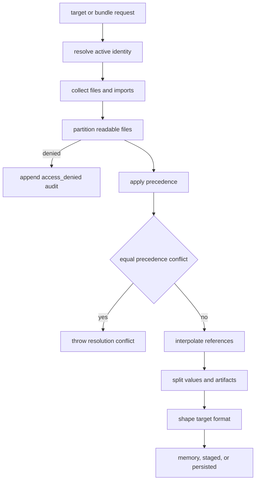

# Resolution and Materialization

`resolveV3Bundle` and `resolveV3Target` in `hush-cli/src/v3/resolver.ts` are the canonical resolution functions. They resolve the active identity, collect local and imported candidates, partition unreadable files, select the highest-precedence candidate per logical path, reject equal-precedence conflicts, interpolate references, and split values from artifacts. `hush-cli/src/v3/materialize.ts` then shapes target or bundle output and manages lifecycle state.

## Resolution order

1. `resolveIdentity` uses an explicit identity or `requireActiveIdentity` from project state.
2. `collectBundleCandidates` follows the bundle and import graph, enforces each import pull allowlist, and rejects recursive bundle/import cycles rather than revisiting a path indefinitely.
3. File ACLs are checked against identity and roles before candidate file documents are loaded/decrypted; unreadable required files fail closed and append an `access_denied` audit event.
4. Local/imported precedence is applied (`local` wins by default; `imported` can be selected explicitly).
5. Equal-precedence logical-path winners produce `HushResolutionConflictError` with provenance rather than silently overwriting.
6. `interpolateCandidates` resolves references across the global path state.
7. Values and artifact entries are shaped for the target format.

Machine-local candidates participate only when the caller explicitly passes `machineLocal: "include"`. This required option prevents a new command from accidentally including personal state in a committed-content operation. The `user/**` namespace cannot collide with repository logical paths; local overrides instead win at the environment-key layer in `collectEnvVars`.

## Materialization lifecycle

`HushMaterializationMode` is `memory`, `staged`, or `persisted`. `HushTempController.initialize` creates a private `0700` temporary root and installs `SIGINT`/`SIGTERM` handlers. Staged files and binaries are written with private `0700` directories and `0600` files. `withMaterializedTarget` and `withMaterializedBundle` audit success or failure and always call `cleanup`; non-persisted temporary roots are removed. A signal records the interruption, cleans up, and is surfaced as `HushMaterializationInterruptedError` after the callback.

`hush run` uses `memory`; `hush push` also uses an in-memory target and passes values directly to Wrangler or the Vercel API; `hush materialize` exposes `staged`/`persisted` output for CI and tooling; and the guarded legacy `decrypt` path is the explicit disk-writing escape hatch. There is no staged CLI command or flag in the current source: passing `--staged` is not a supported public option. The exact public mapping is therefore `hush run` and `hush push` -> `memory`, `hush materialize --output-root <dir>`/`--to <dir>` with `--target` or `--bundle` -> `persisted`, and `hush materialize --cleanup --output-root <dir>` -> persisted-root cleanup. The library's staged mode is an internal extension seam: callers pass `mode: "staged"` to `materializeV3Target`/`materializeV3Bundle` or use the `withMaterializedTarget`/`withMaterializedBundle` callback wrappers. In `staged` mode artifacts are private temporary files consumed during the callback and removed on success, callback failure, or SIGINT/SIGTERM. `hush-cli/tests/v3/materialize.test.ts` explicitly covers staged cleanup on child failure and signals plus restrictive `0700`/`0600` permissions; `runtime-v3.test.ts` checks runtime-staged cleanup. In `persisted` mode `--output-root`/`--to` selects the output root and it remains until the cleanup operation removes it, rather than being deleted by the callback wrapper. Callback failures are rethrown after a failed audit event, while `finally` cleanup still runs. `hush-cli/tests/v3/materialize.test.ts` and `runtime-v3.test.ts` cover persisted output, cleanup, callback/error handling, interruption, and JSON metadata. Persisted output is an explicit request and may use `--output-root`; it is the exception to the no-plaintext-runtime-file rule.

## Shadow policy and data exposure

`hush-cli/src/v3/artifacts.ts` uses `HUSH_ALLOW_LOCAL_OVERRIDES=1` to permit local override shadowing where the default policy rejects it. Unknown and local provider keys remain sensitive by default. `sensitive: false` permits a non-secret projection but does not change encryption or ACL behavior. `hush inspect`, `has`, `status`, `doctor`, `resolve`, `trace`, and `verify-target` support machine-readable output without secret values; `run --json` is intentionally unsupported because the child owns stdout.

Focused evidence is in `hush-cli/tests/v3/resolver.test.ts` for equal-precedence conflicts and ACL outcomes, `hush-cli/tests/v3/fixtures.test.ts` for imported bundle graphs and cycle rejection, `hush-cli/tests/runtime-v3.test.ts` for the case where an unreadable file is rejected before a malformed file is decrypted, `hush-cli/tests/v3/materialize.test.ts` for `materialize --to` persisted output, cleanup and callback failures, and `hush-cli/tests/v3/topology-lifecycle.test.ts` for signal/temporary-root lifecycle.
