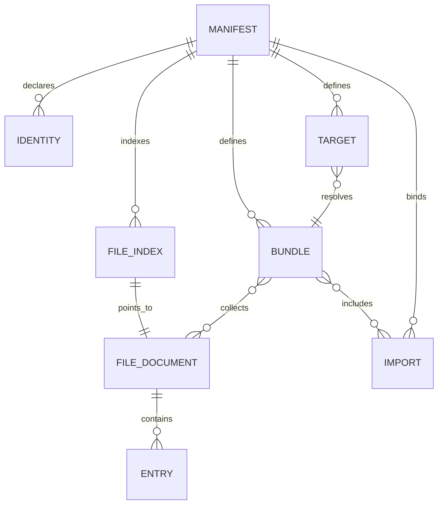

# Shipped V3 Repository Model

The current runtime model is version `3`, enforced by `V3_SCHEMA_VERSION` in `hush-cli/src/v3/schema.ts` and `createManifestDocument` in `hush-cli/src/v3/domain.ts`. `hush-cli/src/v3/repository.ts` decrypts and loads the manifest plus indexed encrypted files. The repository shell is created by `hush bootstrap`; legacy `hush.yaml` repositories are handled only through migration.

## Documents and relationships

The encrypted manifest at `.hush/manifest.encrypted` contains `identities`, optional `activeIdentity`, `fileIndex`, `imports`, `bundles`, `targets`, and metadata. Each `.hush/files/<path>.encrypted` document contains a namespaced file path, `readers.roles`, `readers.identities`, file sensitivity, and entries. A bundle selects files, paths, and imports. A target selects a bundle or logical path and declares an output `format`, optional `mode`, and materialization hints.

The relationships correspond to `HushManifestDocument`, `HushFileDocument`, `HushBundleDefinition`, `HushTargetDefinition`, and `HushImportDefinition` in `hush-cli/src/v3/domain.ts`.

`loadV3Repository` decrypts the manifest, validates it, discovers `.hush/files/**/*.encrypted`, and compares discovered paths with the manifest `fileIndex`. It rejects missing indexed files, unindexed encrypted files, malformed documents, namespace mismatches, missing bundle file references, and targets that reference absent bundles. `persistV3ManifestDocument` validates manifest references before encrypting; `persistV3FileDocuments` snapshots existing encrypted files and performs a multi-file write with rollback on failure, so a mutation cannot intentionally leave a half-updated repository. The repository lifecycle tests in `hush-cli/tests/v3/repository.test.ts`, `topology-lifecycle.test.ts`, and `bootstrap-config.test.ts` are the narrow checks for these consistency and persistence invariants.

## Locked invariants

- Namespaces are exactly `env`, `artifacts`, `bundles`, `user`, and `imports`; roles are `owner`, `member`, and `ci` (`hush-cli/src/v3/schema.ts`).
- Paths are normalized to forward-slash namespaced paths and reject empty, `.` or `..` segments.
- `user/**` is machine-local override storage and cannot be a committed repository file. The canonical override document is `user/local`; `env/project/local` is read for compatibility but is not written or treated as an alias.
- File ACLs are file-scoped. An identity can read when explicitly listed or when one of its roles is listed. `sensitive` controls redaction/projection; it does not encrypt a value or grant access.
- Artifact `filename`, `subpath`, and `materializeAs` hints must be relative and cannot traverse directories.
- A target must reference a bundle or logical path and must have a format; a manifest active identity must exist in `identities`.

## Shipped versus planning sources

Use implementation and focused tests as authority for released behavior: `hush-cli/src/v3/`, `hush-cli/tests/v3/`, and the user migration/reference pages under `docs/src/content/docs/`. `docs/HUSH_V3_SPEC.md` and `docs/HUSH_V3_MIGRATION_STRATEGY.md` are planning/specification material and must not be treated as proof that an unimplemented feature is shipped. When they disagree with code, document current behavior and call out the planning intent separately. `hush-cli/tests/v3/schema.test.ts` proves the locked namespace/role sets and validation rules.

## Scope boundary

V3 owns encrypted repository authority and resolution metadata. Project deployment contracts such as stage-to-surface mapping live in a separate JSON configuration consumed by `hush project`; provider side effects belong to [commands and migrations](../cli/commands-and-migrations.md), not to the schema loader.
