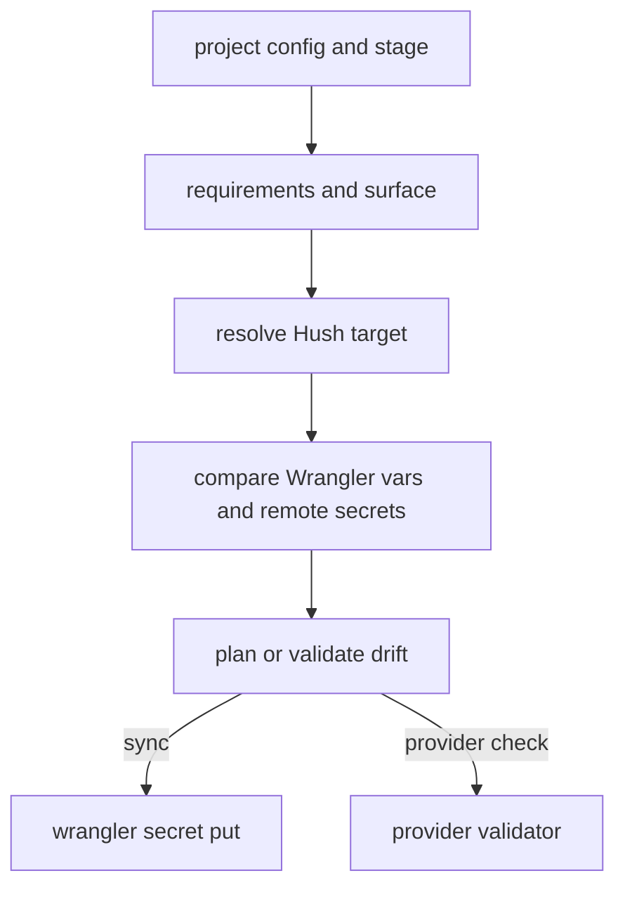

# Command Workflows, Providers, and Migration

Repository lifecycle starts with `hush bootstrap`, which checks SOPS and age, chooses or generates a project age key, writes `.sops.yaml` creation rules, creates `.hush/manifest.encrypted` and the initial `.hush/files/env/project/shared.encrypted`, and registers the initial owner identity plus active-identity state. `hush config` inspects manifest/file/identity/target state; `hush keys` validates or generates age keys; `hush doctor` explains root, key, and store selection. Mutation commands write encrypted YAML through `HushContext` and SOPS, never by writing plaintext repository files. Read-only commands mask values and expose JSON where supported.

## Migration boundary

`hush migrate --from v2` first inventories legacy source files, targets, and schema, then writes validated v3 file documents and manifest references, records migration metadata/completion state, and only permits `--cleanup` after the migrated state is reloaded and validated. A dry run stops before writes. `hush run` and other normal v3 commands reject a legacy-only repository and provide migration guidance, as asserted by `hush-cli/tests/run.test.ts` and `migrate.test.ts`. The migration pages under `docs/src/content/docs/migrations/` describe user procedure; `docs/HUSH_V3_SPEC.md` and related strategy files are planning/spec material, not a guarantee of shipped behavior. `hush-cli/tests/bootstrap-config.test.ts`, `v3/repository.test.ts`, `v3/topology-lifecycle.test.ts`, and `migrate.test.ts` cover bootstrap, reload consistency, mutation lifecycle, and migration cleanup gates.

## Provider push

`pushCommand` first calls `requireV3Repository`, resolves a deployment context and `V3ResolvedEnvView`, then uses the shared target materializer in memory before projecting environment pairs to a provider. Wrangler targets invoke `wrangler secret put <key> [--env <name>]` with the secret value on stdin; Cloudflare Pages uses `wrangler pages secret put <key> --project-name <project> [--env <name>]`. `--dry-run` does not spawn Wrangler and logs key names only. Vercel targets call `https://api.vercel.com/v10/projects/<projectId>/env?upsert=true`, optionally with `teamId`, and submit configured/default `production`, `preview`, and `development` environments. Configuration token, explicit `--token`, target `VERCEL_TOKEN`, then process `VERCEL_TOKEN` are the credential order; non-2xx responses are parsed for `error.message`/`message` and become per-key failures. Keys are classified as `encrypted` only when the resolved entry is explicitly non-sensitive; local/unknown keys default to `sensitive`.

Provider failures are per-key results rather than a promise that all writes succeeded. Tokens and values are passed to the provider process/API, never printed as values. `hush-cli/tests/push.test.ts` is the focused contract for dry-run, environment mapping, token requirements, and failures.

## Project synchronization

`hush-cli/src/commands/project.ts` discovers one of `hush-project-env.json`, `.hush/project-env.json`, `config/hush-project-env.json`, or `packages/runtime-config/config/hush-project-env.json`, unless `--config` is explicit. It combines the configured `contract`, `environmentTargets`, selected `surface`, and `stage` to produce required secret/variable requirements and a topology target. The contract JSON maps runtime surfaces to requirement objects (`name`, `delivery` as `secret` or `variable`, optional `requiredIn`, `topologyTargets`, and `derivedFrom`); environment-target JSON maps each stage name to a record consumed as the selected environment target; the record is required to exist before checks run. The source does not impose a fixed field schema beyond a JSON object: surface configuration supplies the concrete `runtimeSurface`, `topologyTarget`, `wranglerDir`, `hushTargets` stage map, optional `wranglerEnvs` stage map, deploy-secret list, variable expectations, provider validators, and optional Wrangler command; the selected stage record is combined with those fields to derive `stage`, `wranglerEnv`, deploy keys, runtime secret keys, variable requirements, required Hush keys, Wrangler directory, and Wrangler command. `hush-cli/tests/project-command.test.ts` is the concrete fixture for this contract. Each surface selects `runtimeSurface`, `topologyTarget`, `wranglerDir`, Hush target aliases, optional Wrangler environments, deploy secrets, variables, and provider validators. The result schema includes `hushTarget` checks with `required`, `missing`, and `resolvedKeys`; `wranglerVars` checks with per-key `expected`, `actual`, `source`, `missing`, and `mismatched`; worker-secret checks with `secretNames` and `missing`; provider checks with provider/key/status/error; sync results with `synced` and per-key `failed`; and planned actions. `project plan` reports actions; `validate` returns status `ok` or `drift`; `sync` performs Cloudflare secret writes and reports `synced`/`failed` per key. `--dry-run`, `--skip-remote`, `--skip-provider`, and `--surface` control side effects and scope. A failed individual remote write is retained in `failed` while other keys remain represented; the aggregate sync `ok` is false if any write failed, and `dryRun` remains true without remote side effects. Check collections preserve independent `hushTarget`, Wrangler, worker-secret, provider, and sync outcomes so a partial report is inspectable in JSON; the command aggregates them for the selected single stage/surface, not an implicit all-stage transaction. A stage-level `drift` is reported when checks are valid but values differ; mixed check failures remain visible in their individual arrays and make the aggregate status non-OK where the command's validation policy requires it. Malformed config, missing required Hush keys, an absent stage target, or invalid provider setup is a command failure rather than silently successful drift. `--json` returns this structured payload without secret values and uses a nonzero result for invalid/fatal checks while representing ordinary drift as the declared `drift` status. `hush-cli/tests/project-command.test.ts` covers config discovery, missing Hush keys, Wrangler/remote drift, provider checks, skip flags, sync, JSON, and failure behavior.

## Extension contract

Adding a command requires registration in `hush-cli/src/cli.ts`, implementation with `ctx: HushContext`, export consideration in `hush-cli/src/index.ts`, skill regeneration from `skill.ts`, user docs in `docs/src/content/docs/reference/commands.mdx`, and focused tests. Provider changes must also preserve dry-run behavior and avoid secret-value logging.
