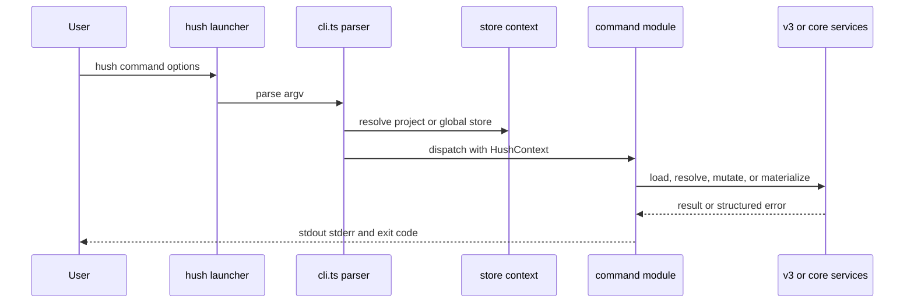

# CLI Entrypoints and Command Surface

Run the source/package launcher with `node hush-cli/bin/hush.js <command>` during repository development, or `hush` after installation. The package declares `bin.hush` as `./bin/hush.js`, exports `./dist/index.js` and types, and builds with `tsc` (`hush-cli/package.json`). The root build uses `bun run --filter @chriscode/hush build`.

## Dispatch

`hush-cli/src/cli.ts` imports every command and defines subcommand groups for `config`, `keys`, `project`, `file`, `bundle`, `target`, `import`, and `completion`. It normalizes aliases such as `-r`/`--root`, parses `--target`, `--global`, `--repo-local`, `--gui`, `--json`, and provider options, then supplies a `HushContext` and resolved `StoreContext` to the selected command. `--help` is repository-free; `--version` reads package metadata or an embedded binary version.

## Command families

- **Repository lifecycle:** `bootstrap`, `init` (deprecated alias), `config`, `migrate`, `keys`, `doctor`, `status`.
- **Secret/file mutation:** `set`, `delete-key`, `copy-key`, `move-key`, `edit`, `file`, `bundle`, `target`, `import`.
- **Safe inspection:** `inspect`, `list`, `has`, `check`, `resolve`, `trace`, `verify-target`, `diff`, `export-example`. `has` accepts `--target <name>` for target-scoped presence checks; `inspect` accepts it to restrict the file inventory and JSON result to one resolved target. Both return `TARGET_NOT_FOUND` for an unknown target and avoid printing values.
- **Runtime/output:** `run`, `materialize`, `push`, `project`.
- **Agent/shell support:** `skill`, `completion`.
- **Retired legacy helpers:** `encrypt`, `decrypt`, `template`, and `expansions` remain explicit compatibility/error paths; normal v3 runtime does not use `hush.yaml`.

Use `hush <command> --help` for the exact option contract. `parseArgs` canonicalizes aliases, rejects unknown options, validates subcommands and command-specific option domains, and permits repeated `--require` and `--environment` values. A `run` command consumes everything after `--` as the child command; flags such as `--target` are rejected where a command does not declare them. `--help` short-circuits before project discovery, while `--version` resolves package metadata or the compile-time embedded version.

The central error path emits human diagnostics through the logger or a versioned JSON document through `jsonError`; JSON data belongs on stdout and diagnostics on stderr. Parse/usage failures use exit status 2, command/runtime failures use status 1, successful commands use 0, and child status is propagated by `run` after cleanup. Unknown commands, options, and subcommands can include a unique edit-distance suggestion. `run --json` exits with `UNSUPPORTED_MACHINE_MODE` before spawning a child because child stdout is uncontrolled. Update checking is a once-per-day network check gated by `HUSH_NO_UPDATE_CHECK`, `NO_UPDATE_NOTIFIER`, and `CI`; it must not change command data output. `hush-cli/tests/cli-help.test.ts`, `command-output.test.ts`, and `run.test.ts` cover these contracts.

## Public library surface

`hush-cli/src/index.ts` exports v3 types and constructors, repository/config/store loaders, resolver/materializer functions, SOPS and format helpers, masking helpers, and command functions. Consumer-facing changes require implementation exports, any command registration, generated skill content, user command docs, and the narrow focused tests. `hush-cli/tests/cli-help.test.ts`, `command-output.test.ts`, and the individual command suites are the contract checks.
