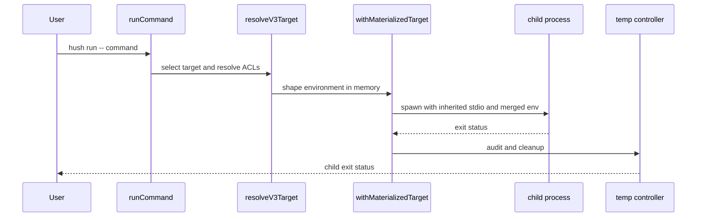

# Runtime Secret Injection

`hush-cli/src/commands/run.ts` is the user-facing runtime path. It rejects missing commands and `--json`, requires a v3 repository through `requireV3Repository`, selects an explicit or default target, and calls `withMaterializedTarget` with `mode: "memory"` and `machineLocal: "include"`.

The child receives the parent environment followed by resolved Hush values. Its working directory is the requested `cwd`. The child's status becomes Hush's status; spawn errors are converted to a command error. `withMaterializedTarget` removes temporary state and signal handlers in `finally`, so cleanup occurs even when the child or resolution fails.

## Non-obvious runtime behavior

- A `.nvmrc` may specify a bare major, major/minor, or exact `vMAJOR.MINOR.PATCH`. Hush searches the parent PATH for an installed Node matching the declared precision and prepends its directory; a full triple remains an exact patch pin. Shell commands using `sh`, `bash`, or `zsh -c` receive a quoted PATH export so nested resolution uses the matching Node. `parseNodeVersionSpec`, `nodeVersionMatchesSpec`, and `findPinnedNodeBin` in `hush-cli/src/commands/run.ts` own this behavior; `hush-cli/tests/run.test.ts` covers it.
- Wrangler targets set `CLOUDFLARE_INCLUDE_PROCESS_ENV=true`. If `.dev.vars` exists, Hush warns because Wrangler may ignore injected process values; remove it when testing injected configuration.
- `run` is guardrail and auditability, not a sandbox. A command such as `hush run -- env` can read injected values.
- `HUSH_NO_UPDATE_CHECK=1`, `NO_UPDATE_NOTIFIER=1`, or `CI` suppresses the daily npm version check.
- `hush materialize` is the deliberate file-writing path; `run` itself does not persist plaintext secret files.

`hush-cli/tests/run.test.ts` verifies legacy repository rejection and JSON rejection before child spawn. Runtime injection, signal cleanup, target selection, and process behavior are covered by `hush-cli/tests/runtime-v3.test.ts` and `hush-cli/tests/v3/materialize.test.ts`.
