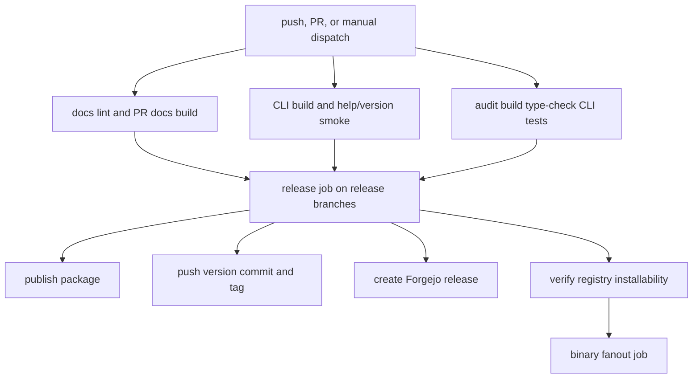

# Build, Test, Lint, and Release

## Exact local commands

- Install: `bun install --frozen-lockfile` (requires Node `>=24 <25`, repository Bun `1.3.14`).
- Build all: `bun run build` (CLI TypeScript, then `docs` Astro build).
- CLI build/test: `bun run cli:build`, `bun run cli:test`, `bun run cli:test:coverage`.
- Type checks: `bun run type-check`; docs only: `bun run docs:build`.
- Lint/format: `bun run lint`, `bun run lint:fix`, `bun run format:check`, `bun run format`, or `bun run fix`.
- Docs: `bun run docs:dev`, `bun run docs:preview`, `bun run docs:deploy`.
- Package checks: `bun run --filter @chriscode/hush verify:pack-install`; local detached delivery: `bun run cli:verify-local-install`.
- Services: use `ch5-svc up`, `ch5-svc status`, `ch5-svc logs docs`, and `ch5-svc down` per `AGENTS.md`; root aliases are `bun run svc:ensure`, `bun run svc:status`, and `bun run svc:stop` but raw `pitchfork list --json` is box-wide.
- Other root scripts: `bun run changelog` and `bun run release` are declared in `package.json` but currently reference absent `scripts/changelog.sh` and `scripts/release.sh`; verify existence before invoking rather than assuming those commands work. `scripts/sync-forgejo-npm-token.sh` synchronizes/checks the Forgejo npm credential without documenting its value.

The CLI package release gate is ordered by `hush-cli/package.json:prepublishOnly`: `bun run build && bun run test && bun run verify-pack-install`. `verify-pack-install.mjs` first runs the source bin `--version`/`--help`, then `npm pack`, inspects `package/bin/hush.js`, creates a temporary npm project, installs the tarball, and repeats version/help checks through the installed `.bin/hush`.

## CI gates

`.forgejo/workflows/ci.yml` is the lightweight hygiene workflow for pushes to `main`, pull requests, and manual dispatch: it installs Bun `1.3.14`, runs `bun install --frozen-lockfile`, then requires `bun run lint` and `bun run format:check`. The workflow uses Node 22 for these tooling checks; local package/build workflows still target the repository's Node `>=24 <25` engine.

`.forgejo/workflows/release.yaml` pins Node `24.14.1`, Bun `1.3.14`, SOPS and age checksums, installs dependencies frozen, audits dependencies, builds, type-checks, runs CLI tests, verifies local installation, and builds docs on PRs. `docs-lint` forbids bare `npx hush` because it can resolve an unrelated package; docs must use `npx @chriscode/hush`.

The release job calculates a conventional-commit bump against the registry version: breaking changes major, `feat` minor, and `fix`, docs, refactor, test, chore, style, ci, or build patch. `main` publishes `latest`; `prerelease-next` publishes `next` prereleases. It checks whether the version is already published, requires `NPM_TOKEN` when a release is due, publishes to `https://npm.ch5.me/`, commits `hush-cli/package.json`, tags, creates a Forgejo release, and verifies the version resolves. Missing authority must fail or skip according to the workflow's explicit gate; do not rotate credentials based on network errors.

## Release sharp edges

The workflow is the authority for current release behavior; comments in `AGENTS.md` may describe earlier event semantics, so inspect `.forgejo/workflows/release.yaml` before retrying. Release binaries depend on `release.outputs.released == true` and consume the pushed version tag. Docs deployment is a Cloudflare Pages side effect and requires the configured Hush/SOPS runtime state in the deployment environment. Never print or commit `NPM_TOKEN`, `SOPS_AGE_KEY`, Cloudflare credentials, or Vercel tokens.

The repository Forgejo workflow (`.forgejo/workflows/release.yaml`) validates source, packages releases, and publishes binaries/docs; the scheduled OpenWiki workflow (`.github/workflows/openwiki-update.yml`) is a separate documentation-refresh job that checks out full history, runs the OpenWiki tool, and proposes changes only under `openwiki/`. OpenWiki is not a product build or release prerequisite, and its model/provider configuration must not be copied into the CLI's runtime secrets topology.
